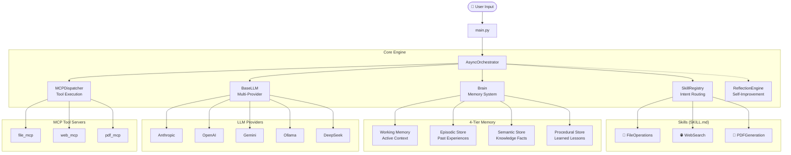
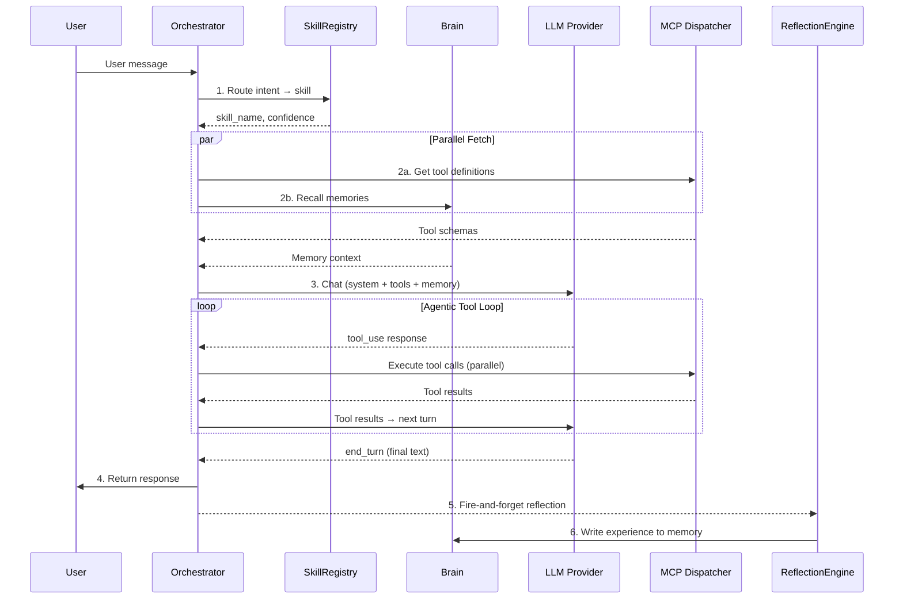
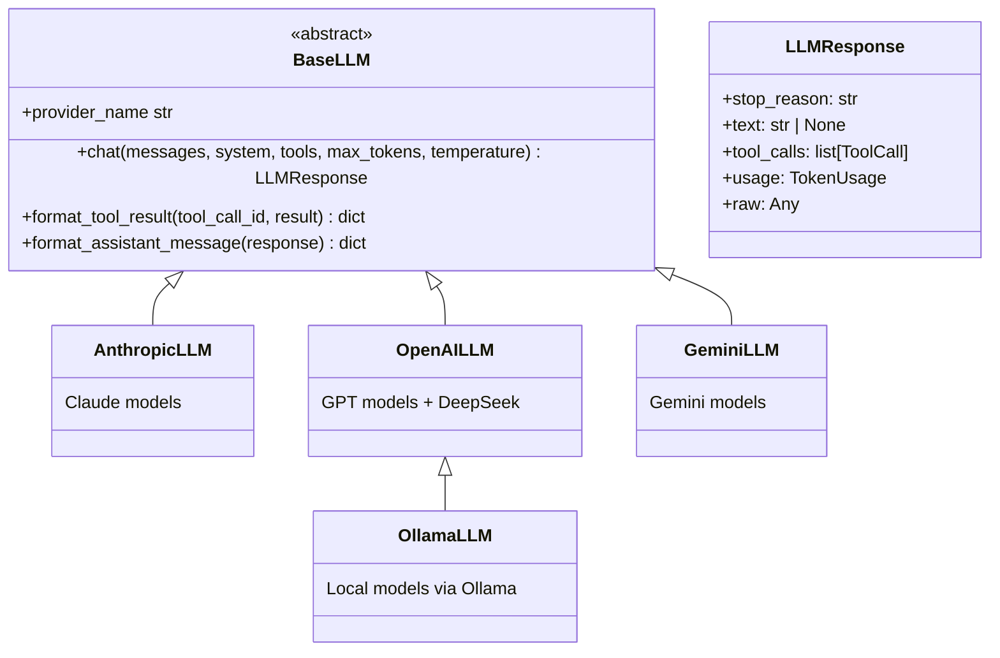

# 🤖 Multi-Agent System with Skill-Based Architecture

A production-grade, **skill-based multi-agent system** built with **MCP (Model Context Protocol)** for tool dispatch, **multi-LLM provider support**, **cognitive memory tiers**, and **self-improving reflection**.

> **Supports:** Anthropic Claude • OpenAI GPT • Google Gemini • DeepSeek • Ollama (local models)

---

## 📐 Architecture Overview



---

## 🔄 Request Lifecycle Flow

Every user request follows this exact pipeline:



### Step-by-Step Breakdown

| Step | Component | Action |
|------|-----------|--------|
| **1** | `SkillRegistry.route()` | Matches user intent to best skill via keyword scoring |
| **2a** | `MCPDispatcher.get_tool_definitions()` | Fetches tool schemas from MCP servers (cached) |
| **2b** | `Brain.recall()` | Fan-out search across episodic, semantic, and procedural stores |
| **3** | `BaseLLM.chat()` | Sends system prompt + skill instructions + memory context + tools |
| **4** | Agentic Loop | Iterates tool_use → tool_result until LLM returns end_turn |
| **5** | `ReflectionEngine.reflect()` | Background analysis: extracts lessons, facts, skill patches |
| **6** | `Brain.write_experience()` | Persists reflection results across all memory tiers |

---

## 📂 Project Structure

```
agents/
├── main.py                          # Entry point — wires all components
├── config.py                        # Settings (pydantic-settings, loads from .env)
├── .env.example                     # Template environment configuration
├── pyproject.toml                   # Dependencies & tool config
│
├── core/                            # Core engine
│   ├── orchestrator.py              # Main agentic loop with tool-use cycling
│   ├── brain.py                     # Unified memory facade (4-tier)
│   ├── skill_loader.py              # Discovers & parses SKILL.md files
│   ├── skill_registry.py            # Intent routing via keyword matching
│   ├── mcp_dispatcher.py            # JSON-RPC to MCP tool servers
│   ├── sub_agent.py                 # Parallel sub-task coordination
│   ├── reflection.py                # Post-task self-analysis & learning
│   ├── logging_config.py            # Structured logging (structlog)
│   ├── observability.py             # OpenTelemetry traces & metrics
│   │
│   ├── llm/                         # Multi-provider LLM abstraction
│   │   ├── __init__.py
│   │   ├── base.py                  # BaseLLM ABC + LLMResponse types
│   │   ├── factory.py               # Provider factory from settings
│   │   ├── anthropic_llm.py         # Anthropic Claude provider
│   │   ├── openai_llm.py            # OpenAI / DeepSeek provider
│   │   ├── gemini_llm.py            # Google Gemini provider
│   │   └── ollama_llm.py            # Ollama (local models) provider
│   │
│   └── memory/                      # Memory subsystems
│       ├── working_memory.py        # Sliding-window conversation buffer
│       ├── episodic_store.py        # SQLite-backed episode history
│       ├── semantic_store.py        # ChromaDB vector knowledge base
│       └── procedural_store.py      # SKILL.md lesson accumulation
│
├── skills/                          # Skill definitions (one folder per skill)
│   ├── file/SKILL.md                # File system operations
│   ├── web/SKILL.md                 # Web search & browsing
│   └── pdf/SKILL.md                 # PDF document generation
│
├── mcp_servers/                     # MCP tool servers
│   └── pdf_mcp.py                   # PDF generation server (reportlab)
│
├── config/                          # Runtime configuration
│   └── mcp_registry.json            # MCP server command registry
│
├── tests/                           # Test suite
│   ├── conftest.py                  # Shared fixtures (FakeLLM, mock stores)
│   ├── test_skill_loader.py         # Skill loader unit tests
│   ├── test_skill_registry.py       # Routing accuracy tests
│   ├── test_llm_providers.py        # LLM abstraction tests
│   ├── test_orchestrator.py         # Integration tests
│   ├── test_memory.py               # Memory subsystem tests
│   └── eval/                        # Evaluation framework
│       ├── hallucination_eval.py    # LLM-as-judge evaluator
│       ├── eval_dataset.jsonl       # Sample evaluation data
│       └── run_eval.py              # CLI evaluation runner
│
└── logs/                            # Log output (auto-created)
    └── agent.log                    # Rotating JSON log file
```

---

## 🚀 Quick Start

### 1. Clone & Install

```bash
git clone <repository-url>
cd agents

# Create virtual environment (Python 3.12+)
uv venv
source .venv/bin/activate  # or .venv\Scripts\activate on Windows

# Install dependencies
uv sync

# For development tools (pytest, ruff)
uv sync --extra dev
```

### 2. Configure

```bash
# Copy the template
cp .env.example .env

# Edit .env with your settings
# At minimum, set your LLM provider and API key
```

**Quick provider setups:**

| Provider | `.env` Settings |
|----------|----------------|
| **Anthropic** | `LLM_PROVIDER=anthropic` `LLM_MODEL=claude-sonnet-4-20250514` `LLM_API_KEY=sk-ant-...` |
| **OpenAI** | `LLM_PROVIDER=openai` `LLM_MODEL=gpt-4o` `LLM_API_KEY=sk-...` |
| **Gemini** | `LLM_PROVIDER=gemini` `LLM_MODEL=gemini-2.0-flash` `LLM_API_KEY=AI...` |
| **Ollama** | `LLM_PROVIDER=ollama` `LLM_MODEL=llama3` (no API key needed) |
| **DeepSeek** | `LLM_PROVIDER=deepseek` `LLM_MODEL=deepseek-chat` `LLM_API_KEY=sk-...` |

### 3. Run

```bash
python main.py
```

---

## 🧠 Core Components Deep Dive

### Brain (4-Tier Memory)

The Brain coordinates four memory tiers that work together to give the agent persistent, contextual intelligence:

| Tier | Purpose | Backend | Retention |
|------|---------|---------|-----------|
| **Working** | Active conversation buffer | In-memory list | Last 20 turns |
| **Episodic** | Past task experiences | SQLite (`aiosqlite`) | Persistent |
| **Semantic** | Knowledge facts & entities | ChromaDB (vector search) | Persistent |
| **Procedural** | Learned skill improvements | SKILL.md files | Persistent |

**Memory recall** fans out to all tiers in parallel via `asyncio.gather()`, minimizing latency.

### Skill System

Skills are defined as `SKILL.md` files with YAML frontmatter:

```yaml
---
name: PDFGeneration
description: Generate professional PDF documents
triggers:
  - generate pdf
  - create pdf
  - export pdf
mcp_servers:
  - pdf_mcp
---

# PDF Generation Guide
Detailed instructions for the agent...
```

**How routing works:**
1. `SkillRegistry.route()` tokenizes the user message
2. Each skill is scored by trigger keyword overlap + description matches
3. The highest-scoring skill is selected with a confidence score (0.0–1.0)

**Adding a new skill:**
1. Create `skills/<name>/SKILL.md` with frontmatter
2. Define triggers (phrases the user might say)
3. List MCP servers the skill needs
4. Write detailed instructions in the markdown body
5. The skill auto-loads on startup — no code changes needed!

### MCP Dispatcher

The dispatcher manages MCP (Model Context Protocol) tool servers via JSON-RPC over stdin/stdout:

1. **Server lifecycle**: Spawns server processes on first use, reuses connections
2. **Tool discovery**: Calls `tools/list` to get available tools, caches results
3. **Tool execution**: Routes `tools/call` to the correct server
4. **Concurrency**: Fires multiple tool calls in parallel via `asyncio.gather()`

### Reflection Engine

After every task, the reflection engine runs a background analysis:
1. Sends the full execution trace to the LLM
2. Extracts: outcome, summary, lessons, facts, skill patches
3. Writes results to all memory tiers in parallel
4. **Self-improvement**: Patches `SKILL.md` files with learned lessons

---

## 🔧 LLM Provider Architecture



**Key design decisions:**
- **Constructor injection**: LLM clients are injected into Orchestrator and ReflectionEngine, not created internally
- **Unified response**: All providers return `LLMResponse` with the same fields
- **Provider-specific formatting**: `format_tool_result()` and `format_assistant_message()` handle API differences
- **Ollama inherits OpenAI**: Since Ollama exposes an OpenAI-compatible API

---

## 📊 Observability

### Structured Logging

Two modes configured via `LOG_FORMAT` in `.env`:

| Mode | Use Case | Format |
|------|----------|--------|
| `console` | Development | Colored, human-readable with `structlog.dev.ConsoleRenderer` |
| `json` | Production | Structured JSON lines, machine-parsable |

Logs are written to both **console** and **file** (`logs/agent.log` with 10MB rotation).

**Key log events:**
- `orchestrator.skill_routed` — Which skill was selected and confidence
- `orchestrator.llm_call` — Provider, duration, token usage per call
- `orchestrator.completed` — Total request duration, tools used
- `reflection.completed` — Reflection outcomes and learned facts
- `llm.initialized` — Provider startup confirmation

### OpenTelemetry Traces & Metrics

**Traces** (span hierarchy per request):
```
orchestrator.run
  ├── skill.routing
  ├── parallel.tools_and_memory
  ├── llm.call.1
  ├── tools.execute
  ├── llm.call.2
  └── ...
```

**Metrics:**
| Metric | Type | Description |
|--------|------|-------------|
| `agent.requests.total` | Counter | Total requests by skill |
| `agent.llm.latency_ms` | Histogram | LLM call duration |
| `agent.llm.tokens.input` | Counter | Input tokens consumed |
| `agent.llm.tokens.output` | Counter | Output tokens consumed |
| `agent.tools.calls` | Counter | Tool calls by name |
| `agent.errors.total` | Counter | Errors by type |

**Exporting to Jaeger/Grafana:**
```env
OTLP_ENDPOINT=http://localhost:4317
SERVICE_NAME=agent-system
```

---

## 🧪 Testing

### Unit Tests

```bash
# Run all tests
pytest tests/ -v

# Run specific test module
pytest tests/test_skill_registry.py -v

# Run with coverage
pytest tests/ --cov=core --cov-report=html
```

Tests use `FakeLLM` (returns canned responses) and in-memory stores to run without real LLM calls.

### Hallucination Rate Evaluation

The eval framework uses **LLM-as-judge** to measure:

| Metric | Definition |
|--------|------------|
| **Faithfulness** | % of response claims grounded in provided context |
| **Hallucination Rate** | 1 - Faithfulness (lower is better) |
| **Factual Accuracy** | % of expected facts present in response |
| **Relevance** | How well the response addresses the input |

```bash
# Run evaluation with default provider
python -m tests.eval.run_eval --dataset tests/eval/eval_dataset.jsonl

# Use a specific provider as judge
python -m tests.eval.run_eval --provider gemini --model gemini-2.0-flash

# Save results and set pass/fail threshold
python -m tests.eval.run_eval --output results.json --threshold 0.2
```

**Sample output:**
```
======================================================================
  HALLUCINATION EVALUATION REPORT
======================================================================
  Samples evaluated:     5
  Duration:              12.3s
----------------------------------------------------------------------
  Avg Faithfulness:      92.0%
  Avg Hallucination Rate:8.0%
  Avg Factual Accuracy:  88.0%
  Avg Relevance:         95.0%
----------------------------------------------------------------------
  ✅ [eval_001]  Faith=100%  Halluc=0%   Facts=2/2  Rel=95%
  ✅ [eval_002]  Faith=90%   Halluc=10%  Facts=3/4  Rel=90%
  ...
======================================================================
```

---

## 📄 PDF Generation Skill

The PDF skill uses a dedicated MCP server powered by `reportlab`:

**Available tools:**
| Tool | Description |
|------|-------------|
| `generate_pdf_from_markdown` | Convert markdown content to styled PDF |
| `generate_pdf_from_data` | Create table reports from JSON data |
| `generate_pdf_from_html` | Render HTML subset to PDF |

**Templates:** `report`, `invoice`, `letter`, `simple`

**Example interaction:**
```
You: Generate a PDF report from this data with title "Sales Q4"
Agent: I'll create a PDF report for you...
       → Calls pdf_mcp__generate_pdf_from_data
       → Generated: output/Sales_Q4_2024-01-15.pdf (3 pages)
```

---

## 🚢 Production Deployment Checklist

- [ ] Set `LOG_FORMAT=json` for machine-parsable logs
- [ ] Configure `OTLP_ENDPOINT` for distributed tracing
- [ ] Set appropriate `LLM_PROVIDER` and `LLM_API_KEY`
- [ ] Use a cheaper model for `REFLECTION_PROVIDER` / `REFLECTION_MODEL`
- [ ] Run `pytest tests/ -v` to validate all components
- [ ] Run hallucination eval: `python -m tests.eval.run_eval --threshold 0.2`
- [ ] Set up log rotation and monitoring for `logs/agent.log`
- [ ] Start ChromaDB server for semantic store (or use ephemeral for testing)
- [ ] Create `brain/` directory for SQLite episodic store

---

## 🤝 Contributing

### Adding a New LLM Provider

1. Create `core/llm/<provider>_llm.py`
2. Inherit from `BaseLLM` and implement `chat()`, `format_tool_result()`, `format_assistant_message()`
3. Add the provider case to `core/llm/factory.py`
4. Add tests in `tests/test_llm_providers.py`

### Adding a New Skill

1. Create `skills/<name>/SKILL.md` with YAML frontmatter
2. Define `name`, `description`, `triggers`, `mcp_servers`
3. Write detailed instructions in the markdown body
4. If needed, create an MCP server in `mcp_servers/` and register it in `config/mcp_registry.json`
5. The skill auto-loads on startup!

---

## 📜 License

MIT